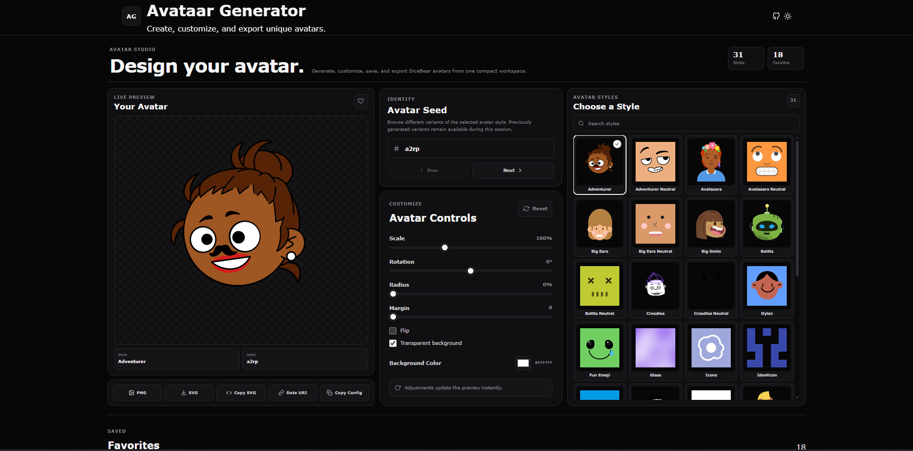

# Avataar Generator

A modern and interactive avatar generator built with React and DiceBear.

Create unique avatars, explore multiple avatar styles, browse generated variants, customize appearance, save favorites, and export avatars in multiple formats.



## Features

- 31 DiceBear avatar styles
- Live avatar preview
- Style search
- Previous and next avatar variant navigation
- Variant history preserved while browsing
- Custom avatar seed support
- Scale adjustment
- Rotation adjustment
- Border radius adjustment
- Margin adjustment
- Horizontal flip
- Transparent background support
- Custom background color
- Save and manage favorite avatars
- Restore saved favorites
- Confirmation dialogs for destructive actions
- Light and dark themes
- Responsive interface
- Copy avatar configuration
- Copy SVG
- Generate Data URI
- Download PNG
- Download SVG
- Lazy-loaded DiceBear styles
- Loading indicators while avatar styles are loaded

## Performance

DiceBear avatar styles are loaded dynamically instead of including every style in the initial application bundle.

This keeps the initial JavaScript bundle smaller while allowing all supported avatar styles to remain available on demand.

## Tech Stack

- React
- Vite
- JavaScript
- styled-components
- DiceBear
- React Icons
- ESLint

## Getting Started

### Clone the repository

```bash
git clone https://github.com/a2rp/avataar-generator.git
cd avataar-generator
```

### Install dependencies

```bash
npm install
```

### Start the development server

```bash
npm run dev
```

### Create a production build

```bash
npm run build
```

### Preview the production build

```bash
npm run preview
```

### Run ESLint

```bash
npm run lint
```

## Project Structure

```text
avataar-generator/
├── public/
│   ├── favicon.ico
│   ├── preview.png
│   └── robots.txt
├── src/
│   ├── components/
│   ├── data/
│   ├── hooks/
│   ├── utils/
│   ├── App.jsx
│   ├── App.styled.js
│   ├── index.css
│   ├── main.jsx
│   └── theme.css
├── eslint.config.js
├── index.html
├── package.json
├── vite.config.js
└── README.md
```

## Avatar Styles

The application provides 31 DiceBear styles:

- Adventurer
- Adventurer Neutral
- Avataaars
- Avataaars Neutral
- Big Ears
- Big Ears Neutral
- Big Smile
- Bottts
- Bottts Neutral
- Croodles
- Croodles Neutral
- Dylan
- Fun Emoji
- Glass
- Icons
- Identicon
- Initials
- Lorelei
- Lorelei Neutral
- Micah
- Miniavs
- Notionists
- Notionists Neutral
- Open Peeps
- Personas
- Pixel Art
- Pixel Art Neutral
- Rings
- Shapes
- Thumbs
- Toon Head

## Avatar Export

Generated avatars can be used outside the application through several export options:

- PNG download
- SVG download
- SVG copy
- Data URI generation
- Configuration copy

## Favorites

Avatars can be saved to Favorites for later access.

Saved favorites are stored locally in the browser, allowing them to remain available across page reloads on the same browser and device.

## Variant Navigation

Each avatar style can generate many different results.

Use the **Prev** and **Next** controls to browse generated variants. Previously generated variants are retained in the current browsing history, allowing backward and forward navigation without requiring a fixed total number of variants.

## Author

**Ashish Ranjan**  
Full-Stack Web Developer

## Links

- Portfolio: https://www.ashishranjan.net
- GitHub: https://github.com/a2rp
- CodePen: https://codepen.io/ash1198
- LinkedIn: https://www.linkedin.com/in/aashishranjan
- Facebook: https://www.facebook.com/theash.ashish/
- YouTube: https://www.youtube.com/@ashishranjan-ashz?sub_confirmation=1
- Email: mailto:ash.ranjan09@gmail.com

## Support

If you find my projects useful and would like to support my work:

- Support Page: https://a2rp-donation-page.netlify.app/
- Buy Me a Coffee: https://www.buymeacoffee.com/a2rp
- Patreon: https://www.patreon.com/a2rp

## License

This project is licensed under the MIT License.

See the [LICENSE](./LICENSE) file for details.
